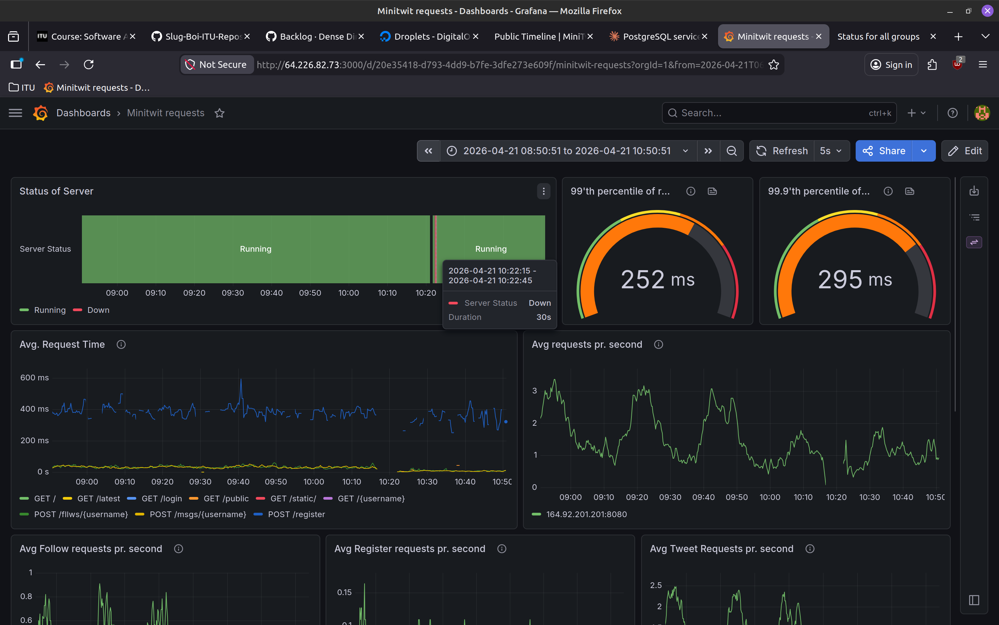

# The initial steps

The original migration to swarm started all the way back from the 22. of March where a giant refactor was scheduled which included the migration from sqlite3 to postgres and as a part of this @Slug-Boi decided that to reduce overall downtime we also try to switch to swarm during this so we would only have a single downtime period. This then also allowed us to ensure overall better uptime since the swarm setup included a blue-green deployment strategy so future updates to the app would result in no downtime for users. The migration changes can be seen in PR #131 on the repo. Once the vagrant file was ready and the new compose file was swarm ready a small group consisting of @Slug-Boi, @August-Brandt and @Flakiator waited till the app seemed to have less trafic to do the actual switch on prod.

## The big switch

The team waited till around the time was around 21 before running the provision. There was roughly 3~ minutes of downtime (measured by our rough estimates during the switch sadly monitoring was not a thing yet). We had issues launching the database but after figuring out what the issue with the postgres container was the entire thing worked perfectly first try. The switch happened using the code from the vagrant file but split manually into 2 bash scripts that were placed on the DO droplet. The first script was an initial setup of docker packages and getting things ready (roughly the first half of the vagrant script from the PR). The second script would kill the binary running the app on the droplet and start the swarm setup by intializing the manager and running the compose file. Lastly as a part of the script we used a CLI tool to migrate our data from our sqlite3 databse into our new postgres container which took roughly 45 seconds in testing. 

## Monitoring the situation

Once the droplet was running we quickly noticed that all trafic towards the frontend (so not the API endpoints) were very slow, they were taking 2+ seconds to respond and was displayed as actual logged warnings in our postgres container. We quickly realised that during our GORM migration of the database we did not index the database. More about this can be read about in our DB migration documentation. Once this was fixed we monitored the app manually for around 15 minutes and saw no signs that anything was looking bad or hindered and left it at that

# Monitor joins the swarm

...

# Downtime

~4 minutes (3 minutes from the initial db manager setup migration an roughly a minute of measured downtime in our dashboard from monitor swarm setup).

