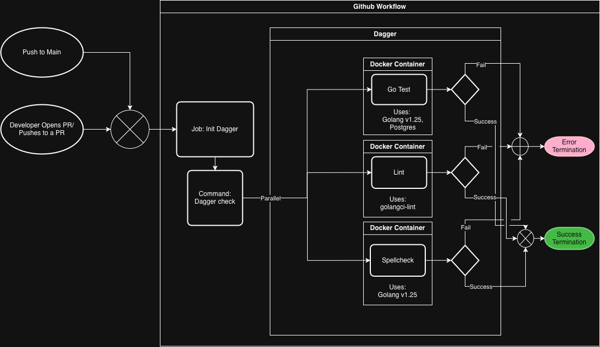

# DevOps Group D

| Name | Email |
| -------- | ------- |
| August Kofoed Brandt | <aubr@itu.dk> |
| Emilia Victoria Helsted | <ehel@itu.dk> |
| Niklas Zeeberg Hessner Christensen | <nizc@itu.dk> |
| Philip Guozhi Han Pedersen | <phgp@itu.dk> |
| Theis Per Holm | <thph@itu.dk> |

## 1. System's Perspective
<!---
Here we need:
A description and illustration of the:

- Design and architecture of your ITU-MiniTwit systems.

- All dependencies of your ITU-MiniTwit systems on all levels of abstraction and development stages. That is, list and briefly describe all technologies and tools you applied and depend on.

- Describe the current state of your systems, for example using results of static analysis and quality assessments.
-->
### 1.2 Design and Architecture

### 1.3 Dependencies

Our Minitwit uses the following dependencies:

#### Core dependencies
<!---
I have kept the descriptions very short due to the word limit of the report. Feel free to make changes to them. - Emy
-->
| Dependency | Description |
| ---------- | ----------- |
| Golang | Open-source programming language by Google. |
| PostgreSQL | Open-source relational database. |
| GORM | ORM library for Go. Adds an abstraction layer between our application and the database |
| Nginx | Acts as a reverse proxy |
| Docker | Enables containerization of system components and orhcestration of nodes using Docker swarm |
| DigitalOcean | A cloud infrastructure provider that offers hosting of websites on droplets (VMs) |
| OpenTofu | An infrastructure-as-code tool serving as an alternative to Terraform. |
| Certbot | An open-source tool for automatically obtaining and renewing TLS certificates to enable HTTPS |
| Ansible | Open-source automation tool for provisioning and configuring infrastructure through declarative playbooks. Replaces Vagrant. |
| Vagrant | **No longer a dependency.**  A tool for building and provisioning development environments. It manages virtual machines defined in vagrantfiles. |

#### Testing and Quality tooling

| Dependency | Description |
| ---------- | ----------- |
| Dagger | A platform for orchestrating tests. Used for running our tests, linter, and spellcheck through Github workflows. |
| Playwright | A web-facing end-to-end testing library |
| misspell | Checks for misspelled words. Part of our Dagger workflow for pull requests. |
| golangci-lint | A universal linter. Part of our Dagger workflow for pull requests. |
| CodeQL | A tool for static code analysis, focused on security and vulnerability detection. |
| SonarQube | A tool for static code analysis, focused on code quality and maintainability. |
| Codacy | A code quality platform that aggregates the results of the static code analysis and presents them in pull requests to support code reviews |

#### Monitoring and Logging

| Dependency | Description |
| ---------- | ----------- |
| Grafana | A platform for real-time visualization and monitoring of system performance through dashboards. |
| Loki | A log aggregation system. It only indexes metadata and integrates easily with Grafana. |
| Loki logging driver for docker | Replaces the default logging driver for docker with one provided by loki. It works just like the default driver, but also sends the logs to Loki.
| Prometheus | Monitoring system that collects and stores time series data for monitoring and alerting through Grafana. |

### 1.4 Current State of our Minitwit

## 2. Process' perspective
 <!---
This perspective should clarify how code or other artifacts come from idea into the running system and everything that happens on the way.

In particular, the following descriptions should be included:

- A complete description and illustration of stages and tools included in the CI/CD pipelines, including deployment and release of your systems.

- How do you monitor your systems and what precisely do you monitor?

- What do you log in your systems and how do you aggregate logs?

- Brief description of how you security hardened your systems.

- How do you handle availability and scaling in your systems?
-->

### 2.1 CI/CD Pipelines

#### Validation pipeline on pull requests

Our PR pipeline is triggered on pull requests and pushes to main to ensure the quality of the code merged into main. When a developer creates a pull request a series of automated quality and security checks are initiated. We run SonarQube, CodeQL, and Codeacy for static code analysis. We also run our test workflow, as seen in the diagram below, which runs our Go tests, linting, and spellchecker misspell, all orchestrated through Dagger. SonarQube and Codacy both post a report on the pull request for a quick overview. We do manual peer reviews where the other developers can suggest changes. We require that all the checks pass and at least two members of our team review and approve the changes in the pull request. When both of these conditions are met the pull request can be merged into main.

<!---
Maybe there whould be a comment on the ignored security checks?
I'm not sure if we should expand or keep it consice, so here are some leftovers that could be integrated with some adjustments. -Emy
SonarQube checks for security vulnerabilities, maintainability, and reliability
CodeQL analyses Github actions, Go, and javascript-typescript for vulnerabilities.

Theis' description. Nice to keep around for now.
Below is a flowchart showing the Test CI pipeline. The start is on the left when a developer pushes code to a PR or a push happens on the branch Main (e.g. when code is merged or rebased onto it). The pipeline uses Dagger which is mentioned in our depenedency tables above. This allows us to create multiplatform workflows (that is workflows that will work on any platform that has some type of action runner) with minimal setup. All the platform specific workflow has to do is start the dagger engine and run the checks.
-->

#### Release Pipeline

Below is a flowchart showing the Release CI pipeline. It is triggered when a version tag is pushed. Dagger orchestrates and runs our Go tests, linting, spellcheck, and Playwright-based end-to-end tests. If all tests succeed we build a packaged release artifact and publish a Docker image, making the new version of Minitwit ready for deployment.

### 2.2 Monitoring of Minitwit

#### Dashboard structure

This is how our minitoring dashboard looks

Data is gathered from the minitwit application by pulling with Prometheus. Logs are aquired by using the Loki logging driver on our minitwit containers, which push to an aggregator container on the monitoring machine. Grafana can then pull data from Prometheus and Loki to display in the dashboard. The dashboard shows:

- If the server is running or is down
- The 99'th and 99.9'th percentile of response time to see if we have requests that are taking longer than they should
- The average time requests take to know how the system is responding in general
- The amount of requests pr second to see the load on the system
- The logs from minitwit to see what is happening on the system

#### Alerting

We set up an alert that used Grafana's build in Discord web hook, such that a Discord bot would send a message in our Discord server in case the minitwit system went down or was unreachable by Prometheus. We tested this artificially but never in practice since the system did not go down after we added the alert.

#### Monitoring issues

One large issue we ran into was that our Promethus setup was not collecting accurate infromation from the minitwit system, after we started using swarm to have multiple replicas. This was an unfortunate side effect of Prometheus being a pull system. Because, when Prometheus tried to pull data it would only get the monitoring data from one of the replicas. To solve this we needed to move over to a push system, where each of the replicas would need a system to push their monitoring data to Prometheus such that it would be able to aggregate data from all the replicas, or show data for each replica. However, we did not have the time to implement this as there where other things that took higher priority, so this never reached the top of the priority list.

### 2.3 Logging

### 2.4 Hardening of Minitwit

After performing a security assesment, we began hardening our Minitwit. First we set up TLS. We started by acquiring a domain through no-IP. Then Nginx was installed and configured as a reverse proxy in front of our Minitwit application. The setup included enabling and configuring a firewall. This was followed by setting up Certbot for handling certificates so we could obtain a TLS certificate for HTTPS.

We hardened our containers by ensuring that they use a non-root user and by scanning our images for vulnerabilities. We found a severe vulnerability in a dependency, which we fixed by updating it.

We have included the static code analysis tool CodeQL in our CI pipeline for scanning for security vulnerabilities in all our pull requests.

Lastly we wanted scan for Docker image vulnerabilities using Trivy, as it seems to easily be integrated to our pipeline in a shift-left manner. We did however not have time for this.

### 2.5 Availability and Scaling

## 3. Reflection Perspective
<!---
Describe the biggest issues, how you solved them, and which are major lessons learned with regards to:

- evolution and refactoring
- operation
- maintenance
of your ITU-MiniTwit systems. Link back to respective commit messages, issues, tickets, etc. to illustrate these.

Also reflect and describe what was the "DevOps" style of your work. For example, what did you do differently to previous development projects and how did it work?
-->

<!---
Lil' thoughts:

- Too many tickets -> felt overwhelming and many were just kinda forgotten/we ended up with duplicates
- Importance of good structure -> again easily overwhelming to keep track of everything as application evolves and grows
- Knowledge silos/ truck factors -> we started talking about changes we've made throughout the week for Friday meetings.

-->

## 4. Use of Generative AI
<!---
ITU's rules on the use of generative AI apply for this report too. They are described https://itustudent.itu.dk/Study%20Administration/Generative%20AI#Guidelines and in detail https://itustudent.itu.dk/-/media/ITU-Student/Study-Administration/GAI/Generative-AI-guidelines-for-students-Spring-2026-pdf.pdf. Please follow them. For your report that means that you have to state which generative AI tools have been used for which task(s) in your projects. Additionally, describe how generative AI tools have been used and briefly reflect and discuss how they supported or hindered your work process.

From the guidelines:
• State which generative AI technology has been used.
• Describe how generative AI technology has been used.
-->
We have used the following generative models while working on our Minitwit:

- ChatGPT
- DeepSeek
- Claude

<!---
Just some flowy thoughts:
I belive we accidently set up CodePilot reviews for some pull requests

In general we have used generative AI to help explain topics and technologies so we could better understand them. 

When refactoring the tests from the original Minitwit, ChatGPT was used for debugging and identifying where the issue was, when there were issues with flashes not being set correctly in main.

For tasks such as translating our vagrant file of over 500 lines of code to an ansible it seemed smart to use generative AI. We did however run into problems with ChatGPT directly translating the code rather that using the perks of ansible to write "good" code. We had to spend a lot of time on fixing the generated code and while there was some learning in it we could have gotten more out of doing it from scratch
-->
