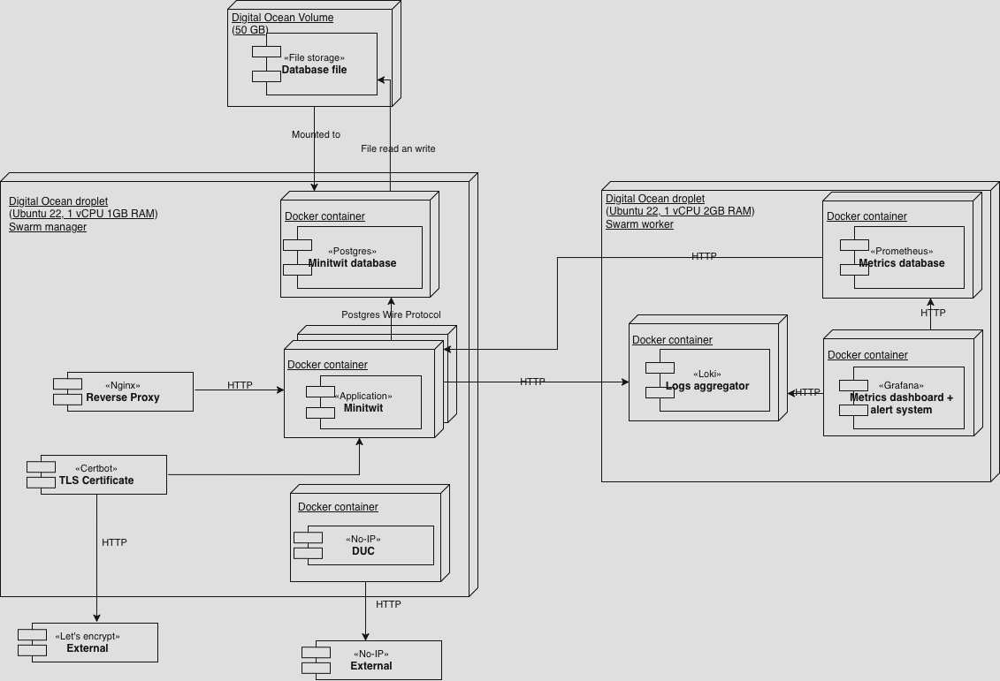
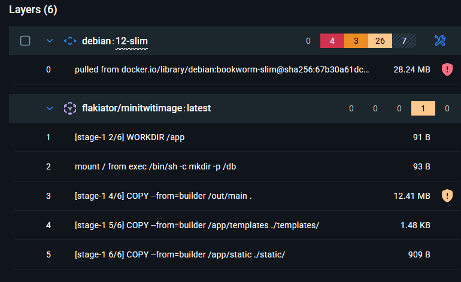
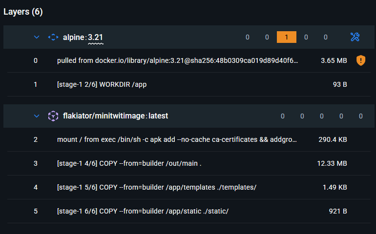
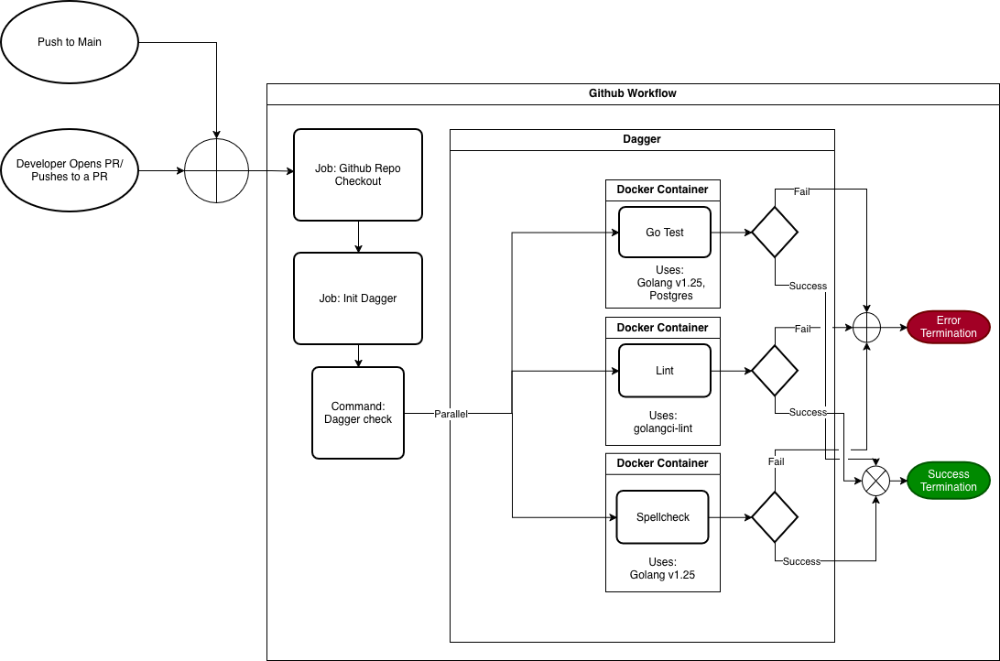
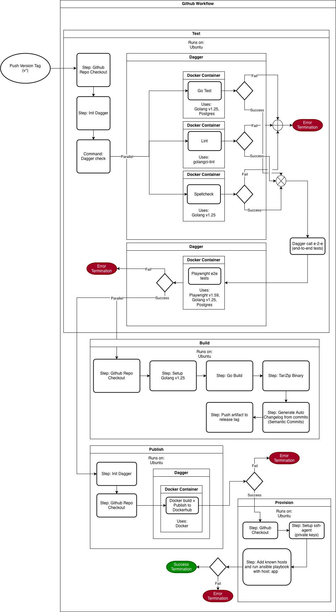
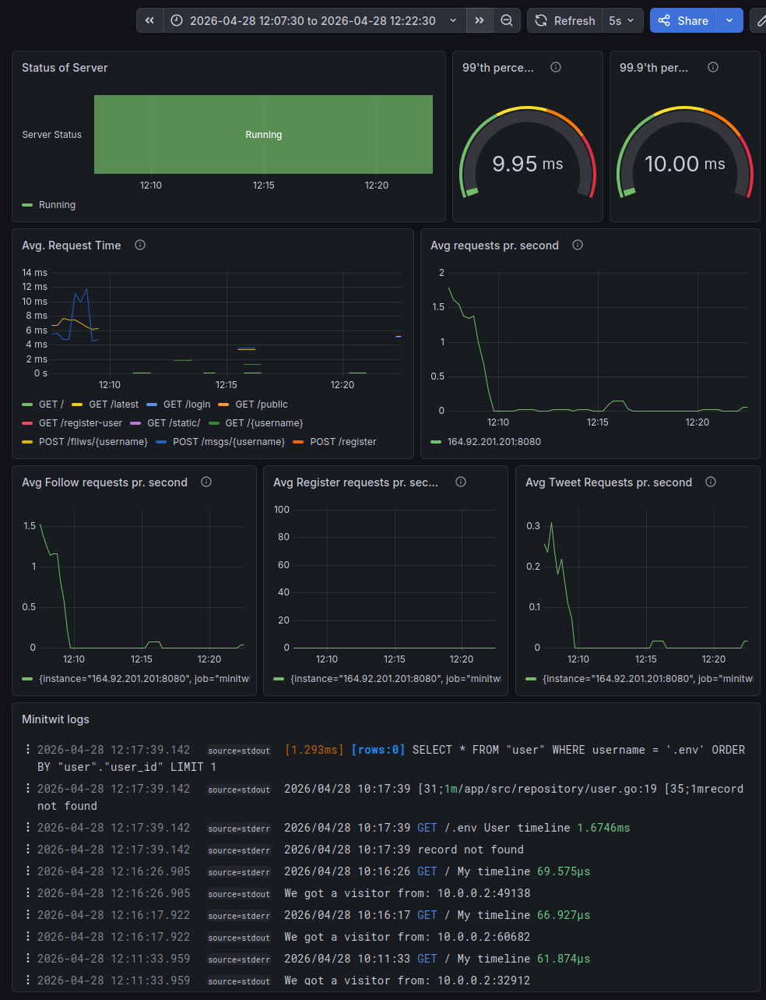

# DevOps Group D

| Name | Email |
| -------- | ------- |
| August Kofoed Brandt | <aubr@itu.dk> |
| Emilia Victoria Helsted | <ehel@itu.dk> |
| Niklas Zeeberg Hessner Christensen | <nizc@itu.dk> |
| Philip Guozhi Han Pedersen | <phgp@itu.dk> |
| Theis Per Holm | <thph@itu.dk> |

## 1. System's Perspective
<!---
Here we need:
A description and illustration of the:

- Design and architecture of your ITU-MiniTwit systems.

- All dependencies of your ITU-MiniTwit systems on all levels of abstraction and development stages. That is, list and briefly describe all technologies and tools you applied and depend on.

- Describe the current state of your systems, for example using results of static analysis and quality assessments.
-->
### 1.2 Design and Architecture

The allocation diagram shows how software elements are mapped to platform elements in the environment of the system. There are 2 droplets running on digital ocean. One droplet runs the containerized version of the minitwit application. The minitwit application is run as 3 replicas using docker swarm, all running on the same droplet. The replicas don't need to be on this one droplet. If another droplet is part of the swarm, then a minitwit replica can be started on that droplet. The reason we are running all the replicas on one droplet is that we where limited to 3 droplets by GitHub Education, the second droplet was running our monitoring setup, which was using most of the available RAM on that droplet, and we were using the the 3rd droplet to have a testing droplet. The swarm manager droplet also contains the minitwit database. The datafiles for the database are stored on an attached DigitalOcean volume that allows the files to persists if the droplet dies. The application containers running on the droplet uses a Loki logging driver which acts as a middleware by sending logs to the Loki aggregator running on the monitoring/logging droplet, before writing the logs to standard output. Metrics from the app are pulled by the Prometheus container also running on the monitoring/logging droplet. Certbot is set up to get a TLS certificate from let's encrypt to enable HTTPS. The Nginx reverse proxy uses the certificate to enable HTTPS for the site and redirects HTTP requests to HTTPS.  No-IP Dynamic Update Client(DUC) is run on a docker container to keep the domain name synchronized with the droplet IP. UFW is used to configure the firewall for the droplet. 

Another droplet runs the monitoring and logging containers. Loki aggregates logs from the application droplet. Prometheus pulls metrics from the application. Grafana pulls the logs from Loki and the metrics from Prometheus, and displays them in a dashboard.

The third and last droplet runs a test environment and is not shown in the diagram above. It was used to test things like ansible and docker swarm before running it on our production environment.

The whole system can be booted up through OpenTofu and Ansible, which is able to create the digital ocean droplets and volume with OpenTofu, and configure and run the application through Ansible.

### 1.3 Dependencies

Our Minitwit uses the following dependencies:

#### Core dependencies

| Dependency | Description |
| ---------- | ----------- |
| Golang | Open-source programming language by Google. |
| PostgreSQL | Open-source relational database. |
| GORM | ORM library for Go. Adds an abstraction layer between our application and the database |
| Nginx | Acts as a reverse proxy |
| Docker | Enables containerization of system components and orchestration of nodes using Docker swarm |
| DigitalOcean | A cloud infrastructure provider that offers hosting of websites on droplets (VMs) |
| OpenTofu | An infrastructure-as-code tool serving as an alternative to Terraform. |
| Certbot | An open-source tool for automatically obtaining and renewing TLS certificates to enable HTTPS |
| No-IP | A Dynamic DNS provider that keeps the domain name in sync with the droplet's IP address using a DUC running on the server |
| Ansible | Open-source automation tool for provisioning and configuring infrastructure through declarative playbooks. Replaces Vagrant. |
| Vagrant | **No longer a dependency.**  A tool for building and provisioning development environments. It manages virtual machines defined in vagrantfiles. |

#### Testing and Quality tooling

| Dependency | Description |
| ---------- | ----------- |
| Dagger | A platform for orchestrating tests. Used for running our tests, linter, and spellcheck through Github workflows. |
| Playwright | A web-facing end-to-end testing library |
| misspell | Checks for misspelled words. Part of our Dagger workflow for pull requests. |
| golangci-lint | A universal linter. Part of our Dagger workflow for pull requests. |
| CodeQL | A tool for static code analysis, focused on security and vulnerability detection. |
| SonarQube | A tool for static code analysis, focused on code quality and maintainability. |
| Codacy | A code quality platform that aggregates the results of the static code analysis and presents them in pull requests to support code reviews |

#### Monitoring and Logging

| Dependency | Description |
| ---------- | ----------- |
| Grafana | A platform for real-time visualization and monitoring of system performance through dashboards. |
| Loki | A log aggregation system & a docker logging driver replacement. It only indexes metadata and integrates easily with Grafana. |
| Prometheus | Monitoring system that collects and stores time series data for monitoring and alerting through Grafana. |

### 1.4 Current State of our Minitwit

#### Security

The group did a security assessment of the system and concluded the following.

- The most critical risks involve the backend API and sensitive credentials
- Infrastructure misconfiguration presents significant risk
- Proper security controls significantly reduce overall risk exposure

The background for these findings was outlined in security assessment which can be found through the link in the appendix.

Additionally for security we used dockerscout to find vulnerabilities in our dockerimage. The initial run resulted in 40 total vulnerabilities 4 of them being high severity.

After fixing these we are down to  vulnerabilities

Lastly we added dependabot very late to the project and as such still have open security issues based on this which can be seen on the Github repository.

#### Code Quality

The project used a few static analysis tools for checking code periodically and on Pull Requests. Codacy was one of these tools and is currently passing on Main. When Codacy found issues on PR's they were fixed before merging into Main. Another static analysis tool we used was Sonarqube Cloud, this one is currently not passing on Main. Sonarqube was extremely badly configured for our project and was therefore very useless for most PR's. Most of the security problems it outlined were due to us not using TLs at the time and most of the code duplication it pointed out was false flags (playwright tests had 80+% code duplication). This tool could have been very useful it we had taken more time to configure it properly but as it stands the tool was mostly a hindrance.

#### Testing

We translated the existing test suite from the Python version of the program and added end-to-end tests to test the UI parts of the webapp. We did not have tests for the API endpoints, as an attempt to mitigate this we have ran the simulator periodically but this should have been a part of the test suite in some way.

#### IaC vs Current State

The Monitoring droplet currently does not mount the services that are running on it as docker volumes this would need to be added to the docker-compose file for the data to be accessible for the different containers. In the past we had set this up mounting a file path (when we were still using vagrant), this was not mirrored in the migration to OpenTofu. Other than this small discrepancy the IaC should match the current system.

## 2. Process' perspective
 <!---
This perspective should clarify how code or other artifacts come from idea into the running system and everything that happens on the way.

In particular, the following descriptions should be included:

- A complete description and illustration of stages and tools included in the CI/CD pipelines, including deployment and release of your systems.

- How do you monitor your systems and what precisely do you monitor?

- What do you log in your systems and how do you aggregate logs?

- Brief description of how you security hardened your systems.

- How do you handle availability and scaling in your systems?
-->

### 2.1 CI/CD Pipelines

#### Validation pipeline on pull requests

Our PR pipeline is triggered on pull requests and pushes to main to ensure the quality of the code merged into main. When a developer creates a pull request a series of automated quality and security checks are initiated. We run SonarQube, CodeQL, and Codeacy for static code analysis. We also run our test workflow, as seen in the diagram below, which runs our Go tests, linting, and spellchecker misspell, all orchestrated through Dagger. SonarQube and Codacy both post a report on the pull request for a quick overview. We do manual peer reviews where the other developers can suggest changes. We require that all the checks pass and at least two members of our team review and approve the changes in the pull request. When both of these conditions are met the pull request can be merged into main.

<!---
Maybe there whould be a comment on the ignored security checks?
I'm not sure if we should expand or keep it consice, so here are some leftovers that could be integrated with some adjustments. -Emy
SonarQube checks for security vulnerabilities, maintainability, and reliability
CodeQL analyses Github actions, Go, and javascript-typescript for vulnerabilities.

Theis' description. Nice to keep around for now.
Below is a flowchart showing the Test CI pipeline. The start is on the left when a developer pushes code to a PR or a push happens on the branch Main (e.g. when code is merged or rebased onto it). The pipeline uses Dagger which is mentioned in our depenedency tables above. This allows us to create multiplatform workflows (that is workflows that will work on any platform that has some type of action runner) with minimal setup. All the platform specific workflow has to do is start the dagger engine and run the checks.
-->

#### Release Pipeline

Below is a flowchart showing the Release CI pipeline. It is triggered when a version tag is pushed. Dagger orchestrates and runs our Go tests, linting, spellcheck, and Playwright-based end-to-end tests. If all tests succeed we build a packaged release artifact and publish a Docker image, making the new version of Minitwit ready for deployment.

<!--
We need to make the release diagram and fix the placeholder here!!!!
-->

### 2.2 Monitoring of Minitwit

#### Dashboard structure

This is how our monitoring dashboard looks

Data is gathered from the minitwit application by pulling with Prometheus. Logs are aquired by using the Loki logging driver on our minitwit containers, which push to an aggregator container on the monitoring machine. Grafana can then pull data from Prometheus and Loki to display in the dashboard. The dashboard shows:

- If the server is running or is down
- The 99'th and 99.9'th percentile of response time to see if we have requests that are taking longer than they should
- The average time requests take to know how the system is responding in general
- The amount of requests per second to see the load on the system
- The logs from minitwit to see what is happening on the system

#### Alerting

We set up an alert that used Grafana's built-in Discord web hook, such that a Discord bot would send a message in our Discord server in case the minitwit system went down or was unreachable by Prometheus. We tested this artificially but never in practice since the system did not go down after we added the alert.

#### Monitoring issues

One large issue we ran into was that our Prometheus setup was not collecting accurate information from the minitwit system, after we started using swarm to have multiple replicas. This was an unfortunate side effect of Prometheus being a pull system. Because, when Prometheus tried to pull data it would only get the monitoring data from one of the replicas. To solve this we needed to move over to a push system, where each of the replicas would need a system to push their monitoring data to Prometheus such that it would be able to aggregate data from all the replicas, or show data for each replica. However, we did not have the time to implement this as there were other things that took higher priority, so this never reached the top of the priority list.

### 2.3 Logging

### 2.4 Hardening of Minitwit

After performing a security assessment, we began hardening our Minitwit. First we set up TLS. We started by acquiring a domain through no-IP. Then Nginx was installed and configured as a reverse proxy in front of our Minitwit application. The setup included enabling and configuring a firewall. This was followed by setting up Certbot for handling certificates so we could obtain a TLS certificate for HTTPS.

We hardened our containers by ensuring that they use a non-root user and by scanning our images for vulnerabilities manually with docker scout. We found 4 severe, 3 moderate and 26 low severity vulnerabilities. Most of these were because we used an old linux distribution, so we switched to a newer one. The remaining low severity vulnerabilities were fixed by updating our Go dependencies.

We have included the static code analysis tool CodeQL in our CI pipeline for scanning for security vulnerabilities in all our pull requests. We have also enabled alerts from Dependabot to ensure up-to-date dependencies.

Lastly we wanted to scan for Docker image vulnerabilities using Trivy, as it seems to easily be integrated to our pipeline in a shift-left manner. We did however not have time for this.

### 2.5 Availability and Scaling

To address availability of the system we made use of Docker Swarm. As seen in the allocation diagram, one droplet is the swarm manager, which has the Postgresql database as well as 3 replicas of the minitwit application. The monitoring machine is a swarm worker that can be managed by the manager. This way updating and restarting monitoring, as well as application related services, can all be managed by one machine. There is a glaring issue with this setup however. If the manager node goes down for some reason, then the application is no longer available. The way that we could have fixed this would be to:

1. Start minitwit application replicas on other droplets such that there are still replicas available if one droplet goes down.
2. Convert the testing droplet into a droplet that is part of the production setup. This would allow us to set all 3 droplets as managers, which would let us maintain a manager if one droplet goes down.
3. Setup another Postgres service on a different droplet to act as a backup using Postgres streaming replication. Then the system can switch to this database if the main database goes down.

The reason we have not implemented these solutions is a combination of lack of time, and the need to have a testing droplet for testing our migration to Ansible and OpenTofu. We were limited to 3 droplets by the fact that we were using GitHub education.

## 3. Reflection Perspective
<!---
Describe the biggest issues, how you solved them, and which are major lessons learned with regards to:

- evolution and refactoring
- operation
- maintenance
of your ITU-MiniTwit systems. Link back to respective commit messages, issues, tickets, etc. to illustrate these.

Also reflect and describe what was the "DevOps" style of your work. For example, what did you do differently to previous development projects and how did it work?
-->

As the course progressed challenges of our project slowly became less about implementing new features and more about handling the growing complexity of the project.

We started suffering from knowledge silos early, which we mitigated by introducing meetings each Friday, where we talked about what we had worked on throughout the week and how it works. It is evident that documentation was more of an afterthought and not sufficient for sharing knowledge across the team. Communication is thus clearly an important part of infrastructure for ensuring maintainability.

When looking at our backlog we see that we have many stale issues and a few duplicates. As the backlog grew the kanban board became less reliable as a planning tool and showed that we would need a better planning structure if we were to continue on with the project.
Ultimately we identified a lot of these small non-technical issues early on but did not do much to mitigate them. This all shows that awareness is not enough and we need to actually dedicate time to address them.

A significant change with this project is the fact that we were responsible for operations after deployment. The project required a shift to a continuous delivery mindset where we had to focus more on quality and maintainability than previously. Our extended feedback loop ensured that we were constantly aware of these qualities through pull requests and monitoring, rather than focusing solely on feature delivery.

 The whole process came with a higher need for coordination than previous projects due to shifting demands and complexity.

<!---
Lil' thoughts:

"Awareness is not resolution"
 
Technical debt in the form of Process debt.

Generative AI adds/reduces technical debt -> Not tried that before. Belongs to GenAI part

From the DevOps handbook:
- We have a high lead time

-->

## 4. Use of Generative AI
<!---
ITU's rules on the use of generative AI apply for this report too. They are described https://itustudent.itu.dk/Study%20Administration/Generative%20AI#Guidelines and in detail https://itustudent.itu.dk/-/media/ITU-Student/Study-Administration/GAI/Generative-AI-guidelines-for-students-Spring-2026-pdf.pdf. Please follow them. For your report that means that you have to state which generative AI tools have been used for which task(s) in your projects. Additionally, describe how generative AI tools have been used and briefly reflect and discuss how they supported or hindered your work process.

From the guidelines:
• State which generative AI technology has been used.
• Describe how generative AI technology has been used.
-->
Our project includes AI-assisted code. We have used the following generative models while working on our Minitwit:

- ChatGPT
- DeepSeek
- Claude

Throughout the course we have used generative AI to explain code and help us understand different topics and technologies, so we could more easily work with them. When we refactored the tests from the original Minitwit, ChatGPT was used to help debug and identify why one of the tests was failing, so we could fix the issue. We have also used generative AI for code generation and to aid us in refactoring parts of the project. We have not tracked our AI usage systematically, so we are not able to identify all specific instances where generated code has been included.

While generative AI helped us with certain tasks and accelerated the process, it also introduced technical debt when its code was included without being properly reviewed. An example was when we refactored from Vagrant to Ansible. Since the vagrantfile consisted of over 500 lines of code, we used ChatGPT to translate it into a playbook. It translated the code too literally and did not take advantage of the way Ansible works. Due to this we had to spend a substantial amount of time on fixing the generated code.
Introducing AI generated code into our codebase also meant that we had code that we did not necessarily understand, which is bad for maintainability. In general we should have been more critical of our use of generative AI as it takes away from our learning when it does our work for us.

<!---
Just some flowy thoughts:
I belive we accidently set up CodePilot reviews for some pull requests

As a group, we did not establish a formal policy or set of guidelines for the use of generative AI during the project, and usage was therefore informal and unregulated. Generative AI was used by multiple team members for tasks such as code generation, debugging, refactoring, and explanation of technical concepts. Since usage was not systematically documented at commit or task level, it is not possible to precisely attribute which parts of the codebase were AI-assisted. However, all contributions, including AI-assisted code, were reviewed and integrated by the team as part of the normal development workflow.
-->
