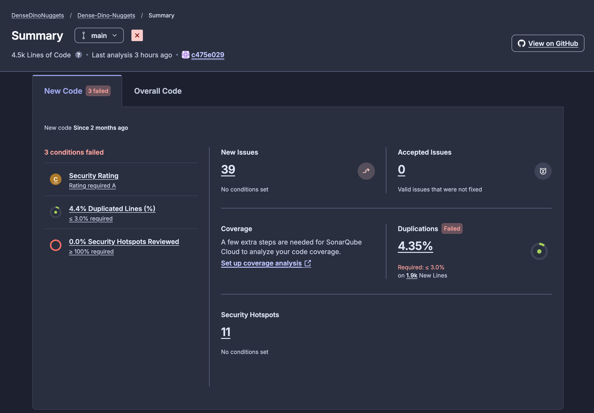

# DevOps Group D

| Name | Email |
| -------- | ------- |
| August Kofoed Brandt | <aubr@itu.dk> |
| Emilia Victoria Helsted | <ehel@itu.dk> |
| Niklas Zeeberg Hessner Christensen | <nizc@itu.dk> |
| Philip Guozhi Han Pedersen | <phgp@itu.dk> |
| Theis Per Holm | <thph@itu.dk> |

## 1. System's Perspective

### 1.2 Design and Architecture

The allocation diagram shows how software elements are mapped to platform elements in the environment of the system. There are two droplets running on DigitalOcean. One droplet runs the Minitwit app container. The Minitwit application is run as three replicas using Docker swarm, on the same droplet. Not all replicas need to run on a single droplet. If another droplet is part of the swarm, then a Minitwit replica can be started on that droplet. We ran all replicas on the same droplet because we were limited to three droplets by GitHub Education, the second droplet was running our monitoring setup. The third droplet is for testing. The swarm manager droplet also contains the Minitwit database. The datafiles for the database are stored on an attached DigitalOcean volume allowing the files to persist if the droplet dies. The application containers use a Loki logging driver acting as middleware by sending logs to the Loki aggregator running on the monitoring/logging droplet, before writing the logs to standard output. Metrics from the app are pulled by the Prometheus container also running on the monitoring/logging droplet. Certbot is set up to get a TLS certificate from Let's Encrypt to enable HTTPS. The Nginx reverse proxy uses the certificate to enable HTTPS for the site and redirects HTTP requests to HTTPS.  No-IP Dynamic Update Client(DUC) is used to keep the domain name synchronized with the droplet IP. UFW is used to configure the firewall for the droplet.

The monitoring/logging droplet runs the monitoring and logging containers. Loki aggregates logs from the application droplet. Prometheus pulls metrics from the application. Grafana pulls the logs from Loki and the metrics from Prometheus, then displays them in a dashboard.

The third droplet runs a test environment and is not shown in the diagram above. It was used to test systems such as Ansible and Docker swarm before running it on our production environment.

The whole system can be booted up by creating the droplets and volume with OpenTofu, and configuring and running the application through Ansible.

### 1.3 Dependencies

Our Minitwit uses the following dependencies:

#### Core dependencies
  
| Dependency | Description |
| ---------- | ----------- |
| Golang | Programming language. |
| PostgreSQL | Relational database. |
| GORM | ORM library for Go. |
| gorilla/mux | HTTP router and dispatcher. |
| godotenv | Module for loading .env files. |
| Nginx | Acts as a reverse proxy. |
| ufw | Firewall management. |
| Docker | Enables containerization of system components and orchestration of nodes using Docker swarm. |
| DigitalOcean | A cloud infrastructure provider. |
| OpenTofu | An infrastructure-as-code tool serving as an alternative to Terraform. |
| Certbot | A tool for automatically obtaining and renewing TLS certificates. |
| No-IP | Dynamic DNS provider. |
| No-IP-DUC | Dynamic IP updater for No-IP. |
| Ansible | Automation tool for provisioning and configuring infrastructure through declarative playbooks. |
| Vagrant | **No longer a dependency.**  A tool for building and provisioning development environments using virtual machines. |

#### Testing and Quality tooling
  
| Dependency | Description |
| ---------- | ----------- |
| Dagger | Workflow orchestration. |
| Playwright | A web-facing end-to-end testing library. |
| misspell | Spellchecker. |
| golangci-lint | A universal linter. |
| CodeQL | Static code analysis, focused on security and vulnerability detection. |
| SonarQube | Static code analysis, focused on code quality and maintainability. |
| Codacy | Aggregates results of static code analysis and presents in PR's. |

#### Monitoring and Logging
  
| Dependency | Description |
| ---------- | ----------- |
| Grafana | Metric and log visualization. |
| Loki | Log aggregation system and logging driver. |
| Prometheus | Timeseries database for metrics |
| Prometheus Client Library | Library for collecting and exposing monitoring data |

### 1.4 Current State of our Minitwit

#### Security
  
 A security assessment of the system revealed the following:

- The most critical risks involve the backend API and sensitive credentials
- Infrastructure misconfiguration presents significant risk
- Proper security controls significantly reduce overall risk exposure

The background for these findings is outlined in the security assessment (link in appendix).

Additionally for security we used Docker Scout to find vulnerabilities in our Docker image. The initial run resulted in a total of 40 vulnerabilities with 4 of them being of high severity.

After fixing these we are down to one vulnerability.

We added Dependabot late into the project and still have open security issues, which can be seen on the Github repository.

#### Code Quality
  
To ensure code quality, we use the static code analysis tools Codacy, SonarQube Cloud, and CodeQL on pull requests. This mitigates misspelled words, code duplication, security issues, etc.  SonarQube is currently not passing on our main branch. It was poorly configured for our project and didn't add a lot of value to our process. All other checks pass.

#### Testing
  
We refactored the existing test suite from the original version of Minitwit and added end-to-end tests to test the UI parts of the web app. We didn't have tests for the API endpoints. As an attempt to mitigate this we have ran the simulator periodically. This should have been a part of the test suite in some way. Currently all tests pass.

#### IaC vs Current State

The monitoring droplet doesn't currently mount the services that are running on it as Docker volumes. This would need to be added to the docker-compose file for the data to be accessible for the different containers. Previously we had set this up by mounting a file path, this was not reflected in OpenTofu. Other than this small discrepancy the IaC should match the current system.

## 2. Process' perspective

### 2.1 CI/CD Pipelines

#### Validation pipeline on pull requests
  
Our validation pipeline is triggered on pull requests and pushes to main to ensure the quality of the code merged into main. When a developer creates a pull request a series of automated quality and security checks are initiated. We also run our test workflow, as seen in the diagram below, which runs our Go tests, linting, and spellchecker Misspell, all orchestrated through Dagger. SonarQube and Codacy both post a report on the pull request. We do manual peer reviews where the other developers can suggest changes. We require that all the checks pass and at least two members of our team review and approve the changes in the pull request.

#### Release Pipeline
  
Below is a flowchart showing the Release CI pipeline. It's triggered when a version tag is pushed. Dagger orchestrates and runs our Go tests, linting, spellcheck, and Playwright-based end-to-end tests. If all tests succeed we build a packaged release artifact, publish a Docker image, and provision the new image to our DO droplet.

### 2.2 Monitoring of Minitwit

#### Dashboard structure
  
This is how our monitoring dashboard looks

Our monitoring dashboard tracks the following:

- If the server is running or is down.
- The 99'th and 99.9'th percentile of response time.
- The average time requests take. For performance insights.
- The amount of requests per second to see the load on the system.
- The logs from Minitwit to see what is happening on the system.

#### Alerting
  
We set up an alert that used Grafana's built-in Discord web hook, so we are notified in case the system becomes unreachable by Prometheus.

#### Monitoring issues
  
After we started using swarm for multiple replicas our Prometheus setup stopped collecting accurate information from the Minitwit application. This was an unfortunate side effect of Prometheus being a pull system. When Prometheus tried to pull data it would only get the monitoring data from one of the replicas. To solve this we need to move over to a push system, where each of the replicas would need to push their monitoring data to Prometheus so it can be aggregated and shown in Grafana. We did, however, not have time to implement this.

### 2.3 Logging

We have logging middleware used for web requests, which logs type of request, endpoint, and execution time of requests. We also use logging in error-prone parts of the code for diagnostics. GORM also has its own logging, which shows information about queries with issues or warnings. An issue is that we use `log.Printf` lines for all our logging. This means that we can't have different levels of logging or filtering of the logs based on type. In practice this didn't lead to any issues, as we didn't have situations where we needed to differentiate types of logs.

### 2.4 Hardening of Minitwit

After performing a security assessment, we began hardening Minitwit. First we set up TLS. We started by acquiring a domain through No-IP. Then Nginx was installed and configured as a reverse proxy in front of the Minitwit application. The setup included enabling and configuring a firewall. This was followed by setting up Certbot for handling certificates so we could obtain a TLS certificate for HTTPS.

We hardened our containers by ensuring that they use a non-root user, and by scanning our images for vulnerabilities manually with Docker Scout. We found 4 severe, 3 moderate and 26 low severity vulnerabilities. Most of these were due to using an old linux distribution, so we switched to a newer one. The remaining low severity vulnerabilities were fixed by updating our Go dependencies.

CodeQL scans for security vulnerabilities in all our pull requests. We have also enabled alerts from Dependabot to ensure up-to-date dependencies.

Lastly we wanted to scan for Docker image vulnerabilities using Trivy, as it seems to easily be integrated into our pipeline in a shift-left manner. We did, however, not have time for this.

### 2.5 Availability and Scaling

To address availability of the system we made use of Docker swarm. As seen in the allocation diagram, one droplet is the swarm manager, which has the PostgreSQL database as well as three replicas of the Minitwit application. The monitoring machine is a swarm worker that can be managed by the manager. This way updating and restarting monitoring, as well as application related services, can all be managed by one machine. There is a glaring issue with this setup however. If the manager node goes down for some reason, then the application is no longer available. The way that we could have fixed this would be to:

1. Start Minitwit application replicas on other droplets such that there are still replicas available if one droplet goes down.
2. Convert the testing droplet into a droplet that is part of the production setup. This would allow us to set all three droplets as managers, which would let us maintain a manager if one droplet goes down.
3. Setup another Postgres service on a different droplet to act as a backup using Postgres streaming replication. Then the system can switch to this database if the main database goes down.

The reason we have not implemented these solutions is a combination of lack of time, and the need to have a testing droplet for testing our migration to Ansible and OpenTofu. 

## 3. Reflection Perspective

As the course progressed challenges of our project slowly became less about implementing new features and more about handling the growing complexity of the system.

We started suffering from knowledge silos early, which we mitigated by introducing meetings each Friday, where we talked about what we had worked on throughout the week. It's evident that documentation was more of an afterthought and not sufficient for sharing knowledge across the team. Communication is thus clearly an important part of infrastructure for ensuring maintainability.

When looking at our backlog we see that we have many stale issues and a few duplicates. As the backlog grew the Github project board became less reliable as a planning tool. This shows that we need a better planning structure, if we were to continue with the project.
Ultimately, we identified a lot of small non-technical issues early on but didn't do much to mitigate them. This shows that awareness is not enough, and we need to actually dedicate time to address them.

A significant change with this project is the fact that we were responsible for operations after deployment. The project required a shift to a continuous delivery mindset where we had to focus more on quality and maintainability. Our extended feedback loop ensured that we were constantly aware of these qualities through pull requests and monitoring, rather than focusing solely on feature delivery.

The whole process came with a higher need for coordination than previous projects due to shifting demands and complexity.

## 4. Use of Generative AI

We made use of the following generative models for our work on Minitwit:

- ChatGPT
- DeepSeek
- Claude

We have used generative AI to explain code and help us understand different topics and technologies, so we could more easily work with them. We also used AI for code generation and to aid us in refactoring parts of the project. While we have made some effort to co-author the AI models when it was used, we have not tracked our AI usage systematically. This means we are not able to identify all instances where generated code has been included.

While generative AI helped us with certain tasks and accelerated the process, it also introduced technical debt when generated code was included without being properly reviewed. An example, was when we refactored from Vagrant to Ansible. Since the vagrantfile consisted of over 500 lines of shell script, we used ChatGPT to translate it into a playbook. It translated the code too literally and didn't take advantage of many Ansible specific features. Due to this we had to spend a substantial amount of time on fixing the generated code.
In general we should have been more critical of our use of generative AI as it sometimes became a bit of a crutch and took away from our learning when it did our work for us.

## Appendix

Additional documentation of mentioned assessments and processes we went through in the project such as:

- [Authentication.md](https://github.com/Slug-Boi-ITU-Repositories/Dense-Dino-Nuggets/blob/main/docs/Authentication.md)

- [MakeWorkVisible.md](https://github.com/Slug-Boi-ITU-Repositories/Dense-Dino-Nuggets/blob/main/docs/MakeWorkVisible.md)

- [ReflectionsOnThreeWays.md](https://github.com/Slug-Boi-ITU-Repositories/Dense-Dino-Nuggets/blob/main/docs/ReflectionsOnThreeWays.md)

- [Security_Assesment.md](https://github.com/Slug-Boi-ITU-Repositories/Dense-Dino-Nuggets/blob/main/docs/Security_Assesment.md)

- [SwarmMigration.md](https://github.com/Slug-Boi-ITU-Repositories/Dense-Dino-Nuggets/blob/main/docs/SwarmMigration.md)

- [TheBigDBMigration.md](https://github.com/Slug-Boi-ITU-Repositories/Dense-Dino-Nuggets/blob/main/docs/TheBigDBMigration.md)

These files as well as the rest of our project can be found at: <https://github.com/Slug-Boi-ITU-Repositories/Dense-Dino-Nuggets/tree/main/docs>
